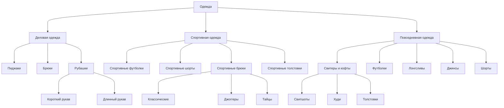

```mermaid
flowchart TD
Одежда ---> A[Деловая одежда]
Одежда ---> B[Спортивная одежда]
Одежда ---> C[Повседневная одежда]

A ---> Пиджаки
A ---> Брюки
A ---> AC[Рубашки]

AC ---> ACA[Короткий рукав]
AC ---> ACB[Длинный рукав]

B ---> BA[Спортивные футболки]
B ---> BB[Спортивные шорты]
B ---> BC[Спортивные брюки]
B ---> BD[Спортивные толстовки]

BC ---> Классические
BC ---> Джоггеры
BC ---> Тайцы

C ---> CA[Свитеры и кофты]
C ---> Футболки
C ---> Лонгсливы
C ---> Джинсы
C ---> Шорты

CA ---> Свитшоты
CA ---> Худи
CA ---> Толстовки

```